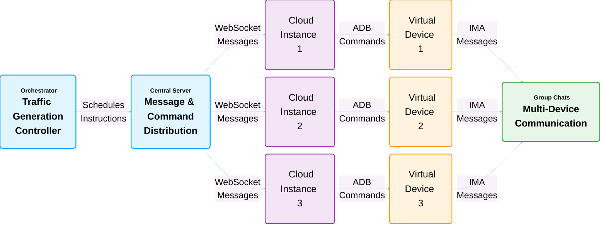
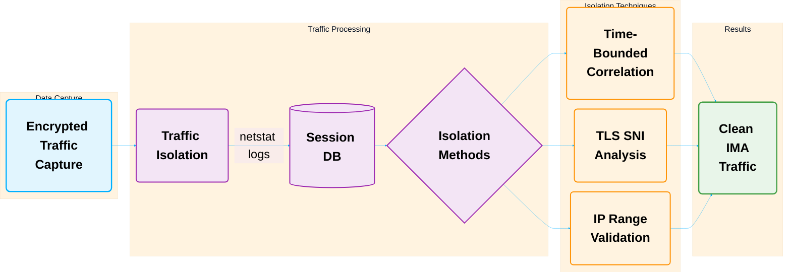

<!-- _paginate: false -->
<!-- _footer: "" -->
<!-- _header: "" -->

# Network Identity Management: Application, Action and Device Aware Monitoring

 

Cenab Batu Bora¹, Julia Silva Weber², Nur Zincir-Heywood²

¹University of Alberta | ²Dalhousie University

*IEEE STPSA 2025 Workshop*

  
  

---

# The Security Challenge in Critical Enterprise Networks

<!-- The Challenge -->

<h3 style="margin-top: 0; color: #c62828;">The Challenge: A Network Black Box</h3>
<ul style="list-style-type: none; padding-left: 0; color: #333;">
  <li style="margin-bottom: 0.8em;  color: #333;"><strong>Encrypted Traffic:</strong> Renders content inspection (DPI) obsolete.</li>
  <li style="margin-bottom: 0.8em;  color: #333;"><strong>Context-Blind Policies:</strong> Firewalls see IPs, not distinct applications.</li>
  <li style="margin-bottom: 0.8em;  color: #333;"><strong>Invisible User Actions:</strong> Impossible to distinguish chats from sensitive file transfers.</li>
  <li style="color: #333;"><strong>BYOD Amplifies Risk:</strong> Unmanaged personal devices create security gaps.</li>
</ul>

<!-- The Dilemma -->

<h3 style="margin-top: 0; color: #283593;">The Result: A Trust Dilemma</h3>

This blindness forces a reactive posture and creates fundamental conflicts:

<ul style="list-style-type: none; padding-left: 0; text-align: center; font-size: 1.1em; font-weight: 500; color: #333;">
  <li style="margin-bottom: 0.7em; color: #333;">Privacy vs. Security</li>
  <li style="margin-bottom: 0.7em; color: #333;">Encryption vs. Visibility</li>
  <li style="color: #333;">User Autonomy vs. Control</li>
</ul>

---

# Research Question & Our Approach

<!-- The Research Question -->

<h3 style="margin-top: 0; color: #c62828; font-size: 1.5em;">The Research Question</h3>

How can organizations improve visibility into encrypted mobile app usage on BYOD networks for policy control, without compromising encryption or user privacy?

<!-- Our Solution -->

<h3 style="margin-top: 0; color: #2e7d32; font-size: 1.5em;">Our Solution</h3>

Machine learning models analyze encrypted traffic metadata to identify applications, devices, and user actions—preserving privacy while enabling security.

---

<!-- Title Box -->

  <h3 style="margin: 0; color: #283593; font-size: 1.6em;">NIM Framework</h3>
  
Identity-based Encrypted Application Monitoring

<!-- Innovation Grid -->

  <!-- ML Models -->
  

    <h4 style="margin: 0; color: #6a1b9a; font-size: 1.1em;">Cloud-Native Traffic Generation</h4>
    
Scalable cloud framework emulates Android devices to generate realistic traffic, enabling robust ML training without specialized hardware.

  

  
  <!-- Classification -->
  

    <h4 style="margin: 0; color: #2e7d32; font-size: 1.1em;">Dynamic Traffic Isolation</h4>
    
Combines time analysis, TLS SNI, and IP whitelisting to isolate app traffic by adapting to dynamic network changes.

  

  
  <!-- Privacy -->
  

    <h4 style="margin: 0; color: #e65100; font-size: 1.1em;">Environment-Agnostic Feature Engineering</h4>
    
Isolates core communication patterns and ignores network-specific metrics to build robust, environment-independent models.

  

  
  <!-- Zero Trust -->
  

    <h4 style="margin: 0; color: #1565c0; font-size: 1.1em;">Granular Identity-Aware Visibility</h4>
    
ML models identify app, device, and action from encrypted traffic, providing granular visibility (e.g., 'User A is on Signal') without decryption.

  

---

# Key Novel Contributions

<!-- ML-Based Analysis -->

  <h3 style="color: #2e7d32; margin: 0; font-size: 1.2em;">1. ML-Based Encrypted Traffic Analysis</h3>
  

    
Advanced metadata analysis for encrypted traffic

    
High-accuracy detection of user actions and apps

    
Identity-driven approach to network monitoring

  

<!-- Cloud-Native Generation -->

  <h3 style="color: #1565c0; margin: 0; font-size: 1.2em;">2. Cloud-Native Traffic Generation</h3>
  

    
Scalable framework for diverse traffic datasets

    
No dependency on sensitive live user data

    
Enables robust ML model development

  

<!-- Behavior Simulation -->

  <h3 style="color: #6a1b9a; margin: 0; font-size: 1.2em;">3. Realistic Behavior Simulation</h3>
  

    
Simulates natural conversation patterns

    
Creates detailed traffic signatures

    
Enables precise app and device identification

  

---

# Experimental Steps

  

    
1

    

      <h3>Traffic Generation Framework</h3>
      <ul>
        <li style="color: #333;">✓ Cloud-native</li>
        <li style="color: #333;">✓ Mobile traffic datasets</li>
      </ul>
    

  

  

    
2

    

      <h3>Traffic Processing</h3>
      <ul>
        <li style="color: #333;">✓ Traffic isolation</li>
        <li style="color: #333;">✓ Dynamic filtering</li>
        <li style="color: #333;">✓ TLS SNI analysis</li>
      </ul>
    

  

  

    
3

    

      <h3>Building the ML pipeline</h3>
      <ul>
        <li style="color: #333;">✓ ANOVA F-value study</li>
        <li style="color: #333;">✓ Feature engineering</li>
        <li style="color: #333;">✓ Model evaluation</li>
      </ul>
    

  

---

# Traffic Generation System

### System Overview
- **Platform:** Cuttlefish on Google Cloud
- **Scale:** 8 concurrent IMAs
- **Duration:** 37 hours of traffic
- **Behavior:** Natural conversation patterns
- **Timing:** 15-60s random intervals
- **Tools:** tcpdump + Tranalyzer2

### Dialogue Schedule Example
| Dialogue | Device | IMA | Wait Time (s) |
|----------|--------|-----|---------------|
| Nay, answer me. ... | 3 | signal | 45 |
| He. ... | 2 | signal | 60 |
| You come most ... | 3 | teams | 55 |
| Not a mouse ... | 3 | skype | 58 |
| Well, good night. ... | 1 | signal | 33 |
| *... conversation continues ...* | | | |

---

# Visualizing the Traffic Generation Framework

<video src="../assets/Real-life%20Click%20Farm.mp4" autoplay loop muted playsinline style="display: block; margin: auto; max-height: 75vh; max-width: 100%;"></video>

---

# Traffic Generation Architecture

---

# Traffic Preprocessing Pipeline

---
# Building the ML Model: App & Device

<!-- Top Box: App & Device ID -->

<h3 style="margin-top: 0; color: #1565c0;">App & Device Identification</h3>

A multi-output model was trained to predict both the application and its source device from a single traffic flow.

<ul style="padding-left: 1.2em;">
  <li style="margin-bottom: 0.5em; color: #333;"><strong>Feature Selection:</strong> ANOVA F-value analysis on 109 raw features to find key identifiers like `tcpMSS`.</li>
  <li style="margin-bottom: 0.5em; color: #333;"><strong>Models Evaluated:</strong> Tree-based classifiers (Decision Tree, Random Forest, Gradient Boosting).</li>
  <li style="margin-bottom: 0.5em; color: #333;"><strong>Top Performer:</strong> Gradient Boosting delivered the highest accuracy for IMA identification.</li>
  <li style="color: #333;"><strong>Validation:</strong> Rigorous 10-fold cross-validation ensured model robustness.</li>
</ul>

---
# Building the ML Model: User Action 

<!-- Bottom Box: Action Classification -->

<h3 style="margin-top: 0; color: #2e7d32;">User Action Classification</h3>

A binary classifier was built to distinguish between group chats and 1-on-1 messages as a proof-of-concept.

<ul style="padding-left: 1.2em;">
  <li style="margin-bottom: 0.5em; color: #333;"><strong>Dataset:</strong> Combined our group chat data with a public 1-on-1 chat dataset for diverse patterns.</li>
  <li style="margin-bottom: 0.5em; color: #333;"><strong>Feature Engineering:</strong> Focused on environment-agnostic patterns (e.g., timing ratios), excluding network-specific metrics.</li>
  <li style="margin-bottom: 0.5em; color: #333;"><strong>Top Performer:</strong> Gradient Boosting again proved most effective.</li>
  <li style="color: #333;"><strong>Insight:</strong> Confirmed that distinct user actions have unique, classifiable metadata signatures.</li>
</ul>

---
# ML Architecture

```mermaid
%%{init: {
  'theme': 'base',
  'themeVariables': {
    'primaryColor': '#e1f5fe',
    'primaryTextColor': '#000',
    'primaryBorderColor': '#00b0ff',
    'lineColor': '#00b0ff',
    'secondaryColor': '#f3e5f5',
    'tertiaryColor': '#fff3e0',
    'fontSize': '20px',
    'messageFontSize': '20px',
    'messageFont': 'arial',
    'nodeFontSize': '20px'
  },
  'flowchart': {
    'nodeSpacing': 20,
    'rankSpacing': 30,
    'padding': 5,
    'width': 1200,
    'height': 400,
    'diagramPadding': 0,
    'htmlLabels': true,
    'curve': 'basis'
  }
}}%%
graph LR
    subgraph Input["Data Input"]
        A["<div style='font-size: 1.2em; padding: 0.5em;'>📊 Labeled Traffic<br>Flows</div>"]
    end

    subgraph Features["Feature Processing"]
        B["<div style='font-size: 1.2em; padding: 0.5em;'>🔢 Raw Feature<br>Extraction</div>"]
        C["<div style='font-size: 1.2em; padding: 0.5em;'>📈 Feature Selection</div>"]
    end

    subgraph Models["ML Models"]
        D["<div style='font-size: 1.2em; padding: 0.5em;'>🤖 Multi-Output<br>Classifiers</div>"]
        G["<div style='font-size: 1.2em; padding: 0.5em;'>🔄 Binary<br>Classifier</div>"]
    end

    subgraph Engineering["Feature Engineering"]
        F["<div style='font-size: 1.2em; padding: 0.5em;'>⚙️ Action-Specific<br>Features</div>"]
    end

    subgraph Predictions["Predictions"]
        E["<div style='font-size: 1.2em; padding: 0.5em;'>🎯 App & Device<br>98.6% F1-Score</div>"]
        H["<div style='font-size: 1.2em; padding: 0.5em;'>👥 Group vs 1:1<br>73.3% F1-Score</div>"]
    end

    A --> B
    B --> C
    C --> D
    D --> E
    
    B --> F
    F --> G
    G --> H

    classDef input fill:#e1f5fe,stroke:#00b0ff,stroke-width:3px,rx:10,ry:10
    classDef features fill:#f3e5f5,stroke:#9c27b0,stroke-width:2px,rx:8,ry:8
    classDef models fill:#fff3e0,stroke:#ff9100,stroke-width:2px,rx:8,ry:8
    classDef engineering fill:#e3f2fd,stroke:#1565c0,stroke-width:2px,rx:8,ry:8
    classDef predictions fill:#e8f5e9,stroke:#43a047,stroke-width:3px,rx:10,ry:10

    class A input
    class B,C features
    class D,G models
    class F engineering
    class E,H predictions

    %% Add styling for better text visibility
    style A font-weight:bold,font-size:20px
    style B font-weight:bold,font-size:20px
    style C font-weight:bold,font-size:20px
    style D font-weight:bold,font-size:20px
    style E font-weight:bold,font-size:20px
    style F font-weight:bold,font-size:20px
    style G font-weight:bold,font-size:20px
    style H font-weight:bold,font-size:20px
```

---

# Performance Results

## **98.6% F1-Score**
### Application Classification
*Gradient Boosting ML Model*

## **~100% Accuracy**
### Device Identification
*Near-perfect ML performance*

## **73.3% F1-Score**
### User Action Classification
*Group vs 1:1 Chats (Overall)*

#### User Action Classification (Gradient Boosting)

| IMA       | Accuracy | Precision | Recall | F1 Score |
|:----------|:--------:|:---------:|:------:|:--------:|
| Discord   | 90.6%    | 90.8%     | 90.2%  | **90.4%**|
| Messenger | 82.2%    | 82.4%     | 80.5%  | 81.1%    |
| Signal    | 50.8%    | 27.4%     | 43.4%  | 33.6%    |
| Slack     | 72.4%    | 72.3%     | 71.8%  | 71.9%    |
| Teams     | 75.8%    | 75.5%     | 76.7%  | 75.5%    |
| Telegram  | 85.5%    | 86.3%     | 84.9%  | 85.2%    |

 

#### Model Performance Comparison (Min-Max Results)

| Model           | App F1 | Device F1 | Action F1 |
|:----------------|:------:|:---------:|:---------:|
| Naive Bayes     | .64-.70| .19-.26   | .30-.88   |
| Decision Tree   | .96-.97| .99-1.0   | .33-.87   |
| Random Forest   | .96-.97| .99-.99   | .32-.89   |
| **Grad. Boost** | **.97-.98**| **.99-1.0** | .33-.90   |
| SVM             | .70-.72| .23-.26   | .30-.91   |

---

# NIM as a Concept

- **Core Idea**: NIM uses encrypted traffic metadata to identify the application, device, and user actions without decryption.
- **Access Control**: It enables role-based access control (RBAC) for encrypted applications.
  - Organizations define access groups (e.g., Developers, Executives).
  - Permissions for applications are assigned to these groups.
- **How it Works**:
  1. Traffic metadata is collected from network points (firewalls, switches).
  2. An ML engine classifies traffic, identifying the app, device, and action.
  3. A policy engine combines this with user identity and group data.
  4. Access rules are enforced via existing infrastructure (SDN, VPNs).
- **Proactive Security**: NIM can proactively block unauthorized application access, aligning with Zero Trust principles.

---

# Future Work

- **Scale the Data Generation**:
  - Increase the number of user groups to twenty or more.
  - Capture richer and more complex multi-user dynamics.

- **Explore Federated Learning**:
  - Train models in a distributed manner without centralizing sensitive data.
  - Enhances user privacy.
  - Allows for collaborative improvements to NIM models across organizations.

---

<!-- _paginate: false -->
<!-- _footer: "" -->

# Conclusion & Discussion

### Thank you for listening!

 

### Open Questions for Discussion:

How can **federated learning** enhance multi-org security?
What **AI ethics** considerations are most critical?

 

**Contact:** cenab@ualberta.ca | **Code & Data:** [GitHub/Zenodo](https://doi.org/10.5281/zenodo.15460189)

